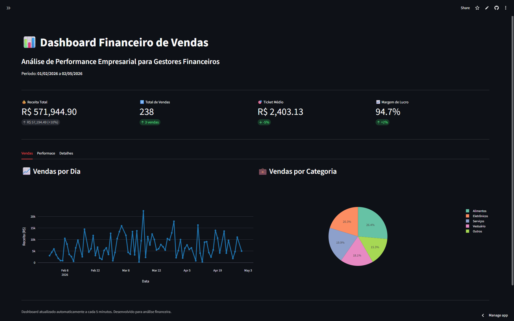

# 📊 Dashboard Financeiro de Vendas - Streamlit


Este projeto consiste em um **Dashboard Interativo** para a visualização e análise de dados financeiros de vendas. Ele foi desenvolvido para demonstrar a criação de interfaces ricas, consumo de APIs simuladas e manipulação de dados utilizando bibliotecas populares do ecossistema Python.

> **💡 Nota:** Este projeto foi inicialmente desenvolvido como parte do aprendizado no curso **"Streamlit: construindo um dashboard interativo"** da Alura, e foi posteriormente refatorado para adoção de boas práticas de modularização, documentação e estrutura de repositórios profissionais.

## 🖼️ Visualização do Dashboard



## ✨ Funcionalidades

- **Filtros Dinâmicos:** Filtre os dados de vendas por período de datas, região, categoria e status da venda.
- **KPIs Financeiros:** Visualização rápida da Receita Total, Total de Vendas, Ticket Médio e Margem de Lucro com indicadores de crescimento (deltas).
- **Gráficos Interativos (Plotly):**
  - Gráfico de linha mostrando o fluxo de vendas diário.
  - Gráfico de pizza com a distribuição de vendas por categoria.
  - Gráficos de barra horizontais para performance por região e os produtos mais vendidos.
  - Ranking de vendedores.
- **Tabela Detalhada:** Exibição completa dos dados em formato tabular com ordenação e formatação monetária.
- **Resumo Executivo:** Seção destacando os melhores resultados e taxas de sucesso.
- **Design Responsivo & Dark Mode:** Adaptação automática ao tema do sistema, garantindo uma interface moderna e agradável.

## 🛠️ Tecnologias Utilizadas

- **[Python](https://www.python.org/):** Linguagem principal do projeto.
- **[Streamlit](https://streamlit.io/):** Framework para a construção da interface web do dashboard.
- **[Pandas](https://pandas.pydata.org/):** Manipulação, limpeza e análise de dados.
- **[Plotly](https://plotly.com/python/):** Criação de gráficos interativos e responsivos.

## 🏗️ Estrutura do Projeto

```text
Dashboard_Streamlit/
│
├── .gitignore              # Arquivos a serem ignorados pelo Git
├── dashboard.py            # Ponto de entrada do aplicativo Streamlit
├── LICENSE                 # Licença MIT
├── README.md               # Documentação do projeto
├── requirements.txt        # Dependências do projeto
│
├── assets/                 # Imagens e recursos estáticos
│   └── dashboard_preview.png
│
└── utils/                  # Módulos utilitários e lógicas separadas
    └── data_generator.py   # Lógica para simulação de chamadas de API e dados
```

## 🚀 Como Executar Localmente

Siga os passos abaixo para rodar o projeto em sua máquina local:

1. **Clone este repositório:**
   ```bash
   git clone https://github.com/Yur1b01c4/Dashboard_Financeiro_de_Vendas_Streamlit.git
   cd Dashboard_Financeiro_de_Vendas_Streamlit
   ```

2. **Crie um ambiente virtual (recomendado):**
   ```bash
   python -m venv venv
   ```

3. **Ative o ambiente virtual:**
   - **Windows:**
     ```bash
     venv\Scripts\activate
     ```
   - **Linux/Mac:**
     ```bash
     source venv/bin/activate
     ```

4. **Instale as dependências:**
   ```bash
   pip install -r requirements.txt
   ```

5. **Execute a aplicação:**
   ```bash
   streamlit run dashboard.py
   ```

6. **Acesso:**
   Acesse a URL informada no terminal, geralmente `http://localhost:8501`.

## 🤝 Contribuindo

Sinta-se à vontade para fazer o fork do projeto e enviar pull requests com melhorias. Caso encontre problemas, abra uma _issue_.

## 📄 Licença

Este projeto está sob a licença MIT. Veja o arquivo [LICENSE](LICENSE) para mais detalhes.
